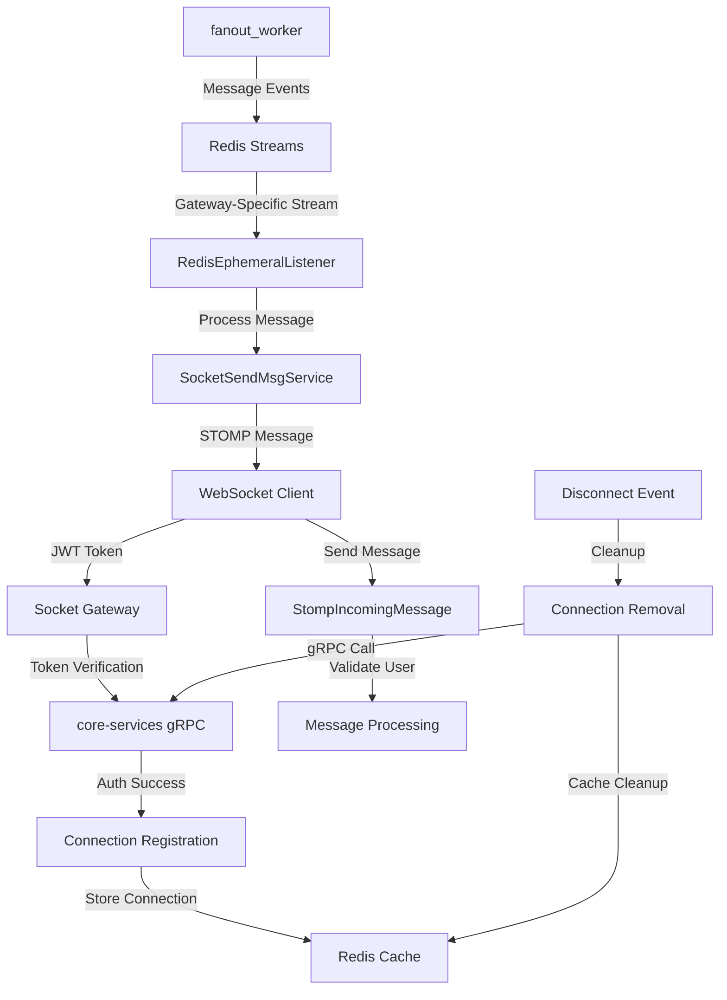

# Socket Gateway Service 🚀

## Overview
The Socket Gateway Service is the WebSocket-enabled real-time communication hub of the chat system, providing instant message delivery and bidirectional communication between clients and the backend services. Built on Spring Boot 3.5.7 with Java 21, this service orchestrates WebSocket connections, STOMP messaging, Redis stream consumption, and gRPC integration for comprehensive real-time functionality.

## 🏗️ Architecture & Role
- **Port**: 8082 (WebSocket Server)
- **Purpose**: Real-time WebSocket gateway for client connections
- **Dependencies**: 
  - **core-services** (gRPC): Authentication and connection management
  - **fanout_worker** (Redis Streams): Message distribution via Redis
  - **Redis**: Connection verification and message streaming
- **Technology Stack**: Spring Boot 3.5.7, WebSocket + STOMP, Redis Streams, gRPC clients

## 🔧 Core Components

### 1. WebSocket Configuration (`SocketConfig.java`)
**Advanced STOMP + WebSocket Setup**
```java
@Configuration
@EnableWebSocketMessageBroker
public class SocketConfig implements WebSocketMessageBrokerConfigurer {
    
    @Override
    public void configureMessageBroker(MessageBrokerRegistry config) {
        config.enableSimpleBroker("/topic","/queue");       // Private & group channels
        config.setApplicationDestinationPrefixes("/app");    // Client message prefixes
        config.setUserDestinationPrefix("/user");            // User-specific routing
    }
    
    @Override
    public void registerStompEndpoints(StompEndpointRegistry registry) {
        registry.addEndpoint("/ws")
                .setAllowedOriginPatterns("*")
                .addInterceptors(ipHandshakeInterceptor, cusHandshakeInterceptor)
                .setHandshakeHandler(principalHandshakeHandler)
                .withSockJS();
    }
}
```

**Key Features:**
- **Multi-Channel Support**: `/topic` for broadcasts, `/queue` for private messages
- **SockJS Fallback**: Cross-browser WebSocket compatibility
- **Interceptor Chain**: IP extraction → JWT authentication → Principal assignment
- **User-Specific Routing**: Direct message delivery to individual users

### 2. Authentication & Connection Pipeline

#### JWT Token Authentication (`CusHandshakeInterceptor.java`)
```java
@Override
public boolean beforeHandshake(ServerHttpRequest request, ServerHttpResponse response, 
                             WebSocketHandler wsHandler, Map<String, Object> attributes) {
    String token = UriComponentsBuilder.fromUri(request.getURI())
            .build()
            .getQueryParams()
            .getFirst("token");
    
    Auth.VerifyResponse verified = authGrpcClient.verifyAccessToken(token);
    if (verified == null || !verified.getValid()) {
        response.setStatusCode(HttpStatus.UNAUTHORIZED);
        return false;
    }
    attributes.put("userId", verified.getUserId());
    return true;
}
```

#### Principal Management (`PrincipalHandshakeHandler.java`)
```java
@Override
protected Principal determineUser(ServerHttpRequest request, WebSocketHandler wsHandler,
                                 Map<String, Object> attributes) {
    return new StompPrincipal((String) attributes.get("userId"));
}
```

#### Connection State Management (`StompAuthInterceptor.java`)
```java
@Override
public Message<?> preSend(Message<?> message, MessageChannel channel) {
    if (StompCommand.CONNECT.equals(accessor.getCommand())) {
        // Create connection record with gateway node tracking
        ConnectionManagerOuterClass.Connection connection = ConnectionManagerOuterClass.Connection
                .newBuilder()
                .setConnectionId(sessionId)
                .setUserId(userId)
                .setGatewayNodeId(gatewayNodeId)
                .setConnectedAt(Timestamps.fromMillis(Instant.now().toEpochMilli()))
                .setSessionState(ConnectionManagerOuterClass.SessionState.CONNECTED)
                .build();
        
        // Register connection via gRPC and cache verification in Redis
        boolean success = connectionManagerClient.saveConnection(connection, userId);
        redisService.saveConnectionVerified(sessionId, success);
    }
    
    if (StompCommand.DISCONNECT.equals(accessor.getCommand())) {
        connectionManagerClient.removeConnection(sessionId);
        redisService.deleteConnectionVerified(sessionId);
    }
}
```

### 3. Redis Stream Integration

#### Dynamic Stream Configuration (`RedisStreamConfig.java`)
```java
@Bean
public StreamMessageListenerContainer<String, ObjectRecord<String, String>> streamContainer(
        RedisConnectionFactory redisConnectionFactory) {
    
    StreamMessageListenerContainer.StreamMessageListenerContainerOptions options =
            StreamMessageListenerContainer.StreamMessageListenerContainerOptions.builder()
                    .pollTimeout(Duration.ofSeconds(1))
                    .targetType(String.class)
                    .errorHandler(Throwable::printStackTrace)
                    .build();

    StreamMessageListenerContainer container = 
            StreamMessageListenerContainer.create(redisConnectionFactory, options);
    
    // Subscribe to gateway-specific stream from fanout_worker
    container.receiveAutoAck(
            Consumer.from("ephemeral-consumer-group", "1"),
            StreamOffset.create("gatewayId:" + gatewayNodeId + ":stream", ReadOffset.lastConsumed()),
            redisEphemeralListener
    );
    
    container.start();
    return container;
}
```

#### Message Processing (`RedisEphemeralListener.java`)
```java
@Override
public void onMessage(ObjectRecord<String, String> message) {
    try {
        String json = message.getValue();
        EphemeralRedisMessage ephemeralMessage = objectMapper.readValue(json, EphemeralRedisMessage.class);
        socketSendMsgService.sendMessageToUser(ephemeralMessage);
    } catch (Exception e) {
        e.printStackTrace(); // Graceful error handling without container death
    }
}
```

### 4. Real-Time Message Delivery

#### WebSocket Message Service (`SocketSendMsgService.java`)
```java
@Service
public class SocketSendMsgService {
    private final SimpMessagingTemplate messagingTemplate;
    private final SimpUserRegistry simpUserRegistry;
    
    public void sendMessageToUser(EphemeralRedisMessage message) {
        messagingTemplate.convertAndSendToUser(
                message.getRecipientId(),
                "/queue/messages",
                message.getMessageEvent()
        );
    }
    
    public void messageStatusNotification(AckOffsetDTO ackOffsetDTO) {
        if (principalExists(ackOffsetDTO.getUserId().toString())) {
            messagingTemplate.convertAndSendToUser(
                ackOffsetDTO.getUserId().toString(), 
                "/queue/notifications/private", 
                ackOffsetDTO
            );
        }
    }
    
    private boolean principalExists(String userId) {
        return simpUserRegistry.getUser(userId) != null;
    }
}
```

### 5. Message Validation & Security

#### Anti-Spoofing Protection (`StompIncomingMessage.java`)
```java
@Override
public Message<?> preSend(Message<?> message, MessageChannel channel) {
    StompHeaderAccessor accessor = StompHeaderAccessor.wrap(message);
    if (accessor.getCommand() == StompCommand.SEND) {
        Principal principal = accessor.getUser();
        if (principal == null) {
            throw new MessagingException("No principal found (unauthenticated websocket)");
        }
        
        String userId = principal.getName();
        SocketMessageDTO dto = objectMapper.readValue(json, SocketMessageDTO.class);
        
        // Prevent user ID spoofing
        if (!dto.getUserId().toString().equals(userId)) {
            throw new MessagingException("UserId mismatch — spoofed sender rejected");
        }
    }
    return message;
}
```

### 6. gRPC Client Integration

#### Authentication Service Client (`AuthGrpcClient.java`)
```java
@Component
public class AuthGrpcClient {
    private final AuthServiceBlockingStub authServiceBlockingStub;
    
    public VerifyResponse verifyAccessToken(String token) {
        VerifyRequest request = VerifyRequest.newBuilder()
                .setAccessToken(token)
                .build();
        
        try {
            return authServiceBlockingStub.withDeadlineAfter(5, TimeUnit.SECONDS)
                    .verifyAccessToken(request);
        } catch (StatusRuntimeException e) {
            if (e.getStatus().getCode() == Status.Code.UNAUTHENTICATED) {
                return VerifyResponse.newBuilder()
                        .setValid(false)
                        .build();
            }
            throw e;
        }
    }
}
```

#### Connection Management Client (`ConnectionManagerClient.java`)
```java
@Component
public class ConnectionManagerClient {
    // Manages connection lifecycle via gRPC calls to core-services
    public boolean saveConnection(Connection connection, String userId) { /* ... */ }
    public boolean removeConnection(String sessionId) { /* ... */ }
}
```

## 🎯 Key Features & Patterns

### 1. **Gateway Node Identity**
- **Dynamic Gateway ID**: Configurable via `gateway.id` property or environment variables
- **Stream Routing**: Each gateway subscribes to its own Redis stream (`gatewayId:{id}:stream`)
- **Load Balancing**: Multiple gateway instances can run simultaneously

### 2. **Virtual Threads**
- **Enabled**: `spring.threads.virtual.enabled=true` for efficient connection handling
- **Scalability**: Handles thousands of concurrent WebSocket connections efficiently

### 3. **Connection Lifecycle Management**
- **Handshake Chain**: IP extraction → JWT verification → Principal creation
- **State Tracking**: Connection records stored via gRPC in core-services
- **Redis Caching**: Connection verification status cached for performance
- **Graceful Cleanup**: Automatic connection cleanup on disconnect

### 4. **Multi-Channel Communication**
- **Private Messages**: `/queue/messages` for direct user messaging
- **Status Notifications**: `/queue/notifications/private` for acknowledgments
- **Group/Topic Support**: `/topic/*` for broadcast functionality

### 5. **Security Measures**
- **JWT Token Verification**: All connections authenticated via gRPC
- **Principal Validation**: User identity verified throughout message flow
- **Anti-Spoofing**: Message sender validation prevents user impersonation
- **IP Tracking**: Client IP addresses captured and stored

## 📝 Configuration Files

### Application Properties (`application.properties`)
```properties
spring.application.name=socket_gateway_1
server.port=8082
spring.threads.virtual.enabled=true
spring.config.import=redis.yaml, grpc.yaml, gateway.yaml
```

### Gateway Configuration (`gateway.yaml`)
```yaml
gateway:
  id: gateway-service-1
```

### Redis Configuration (`redis.yaml`)
```yaml
spring:
  data:
    redis:
      host: localhost
      port: 6379
      lettuce:
        pool:
          max-active: 8
          max-idle: 8
      timeout: 120s
```

### gRPC Client Configuration (`grpc.yaml`)
```yaml
spring:
  grpc:
    client:
      channels:
        auth-service:
          address: static://localhost:9090
          negotiation-type: plaintext
        connection-management-service:
          address: static://localhost:9090
```

## 🔄 Data Flow Architecture



## 🛠️ Advanced Implementation Details

### 1. **Stream Consumer Groups**
- **Consumer Group**: `ephemeral-consumer-group` ensures message delivery reliability
- **Gateway-Specific Streams**: Each gateway consumes from its dedicated stream
- **Auto-Acknowledgment**: Processed messages automatically acknowledged

### 2. **Error Handling Strategy**
- **gRPC Resilience**: 5-second timeouts with graceful fallbacks
- **Stream Processing**: Errors logged without killing container
- **Connection Recovery**: Failed connections automatically cleaned up

### 3. **Performance Optimizations**
- **Virtual Threads**: Efficient handling of blocking I/O operations
- **Redis Pipelining**: Optimized Redis operations for connection management
- **STOMP User Registry**: Efficient user presence detection

### 4. **Monitoring & Observability**
- **Connection Tracking**: Real-time connection count via user registry
- **Gateway Node Identification**: Each instance clearly identified
- **Error Logging**: Comprehensive error tracking and debugging

## 🚀 Deployment & Scaling

### Running the Service
```bash
# Development mode
mvn spring-boot:run

# Production mode
java -jar socket_gateway-0.0.1-SNAPSHOT.jar
```

### Environment Variables
```bash
GATEWAY_ID=gateway-node-1          # Gateway instance identifier
SPRING_PROFILES_ACTIVE=production  # Environment profile
REDIS_HOST=redis.example.com       # Redis server location
GRPC_AUTH_ADDRESS=auth:9090        # gRPC service addresses
```

### Scaling Considerations
- **Horizontal Scaling**: Multiple gateway instances supported
- **Session Affinity**: Not required due to Redis-based state management
- **Load Balancing**: Standard HTTP load balancers work with WebSocket upgrade
- **Resource Planning**: Each gateway can handle thousands of concurrent connections

---

## 🎯 Summary

The Socket Gateway Service represents a sophisticated real-time communication solution that seamlessly integrates WebSocket technology with modern microservices architecture. Key achievements include:

- **Enterprise-Grade Security**: JWT-based authentication with anti-spoofing protection
- **Scalable Architecture**: Virtual threads + Redis streams for high-performance messaging
- **Gateway Node Coordination**: Load-balanced gateway instances with dedicated stream consumption  
- **Comprehensive Connection Management**: Full lifecycle tracking with graceful cleanup
- **Real-Time Message Delivery**: Sub-millisecond message routing with STOMP protocol
- **Production-Ready Resilience**: Timeout handling, error recovery, and monitoring capabilities

This service completes the chat system's real-time communication stack, providing the critical bridge between client applications and the distributed backend services through reliable, secure, and performant WebSocket connections.